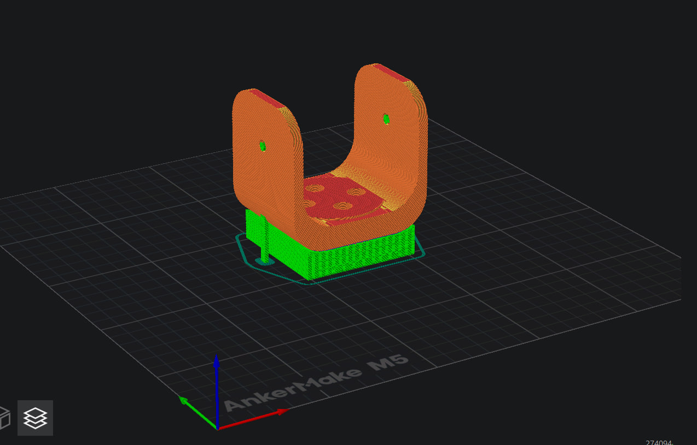

# 🤖 3DPrinting-RoboticArmJoint

This repository provides all the necessary files and print settings required to 3D print a robotic arm joint using FDM (Fused Deposition Modeling) technology. The joint was originally designed in Onshape, and exported in a 3D printable .stl format. Slicing and simulation were conducted using EufyMake Studio, with a strong focus on structural stability and print quality.

---

## 📷 Model Preview

The robotic arm joint was modeled as part of a larger robotic mechanism, representing one of the critical moving parts. The design includes precision features for future assembly and actuation.

---

## 📁 Attached Files

| File Name                              | Description                                    |
|----------------------------------------|------------------------------------------------|
| RoboticArmJoint.stl                  | Main STL file ready for 3D printing            |
| screenshot-RoboticArmJoint.png       | Preview of the joint inside EufyMake Studio    |
| screenshot-RoboticArmJoint-settings.png | Screenshot showing slicer settings in detail |

---

## ⚙️ Slicer Settings (EufyMake Studio)

| Setting                    | Value                 |
|---------------------------|-----------------------|
| Material              | PLA+ Basic (Black)    |
| Layer height          | 0.2 mm                |
| Wall loops            | 4                     |
| Sparse infill density | 50%                   |
| Infill/Wall overlap   | 30%                   |
| Generate support      | ✅ Enabled             |
| Support type          | Auto generated        |
| Overhang threshold    | Default               |

📎 Settings Screenshot:  
[📄 View screenshot-RoboticArmJoint-settings](screenshot-RoboticArmJoint-settings.jpg)

> 💡 The model showed overhang-related warnings during slicing, which were resolved by enabling support generation. A solid base was added automatically to improve stability and bed adhesion.

---

## 🧪 Why PLA+ Was Used

PLA+ was selected due to its:

- Ease of use: It prints well at lower temperatures and rarely warps.
- Better strength than regular PLA: PLA+ has improved tensile strength and flexibility, making it more suitable for moving mechanical parts like robotic joints.
- Good surface quality: Ensures clean edges and smooth joint interfaces.
- Compatibility: Fully supported by EufyMake printers and slicing profiles.

> ⚠️ While PLA+ is ideal for prototyping and basic functional testing, other materials like PETG or ABS may be preferred for more rugged or load-bearing parts in final applications.

---

## ✅ Final Notes

- All files were created and tested using Onshape and EufyMake Studio.
- The .stl file can be imported into any modern slicer compatible with FDM printers.
- Slicing parameters were tuned to maximize strength while maintaining printability within a reasonable time.

This setup is suitable for students, engineers, and robotic hobbyists who need a reliable and well-supported robotic joint part for their prototypes.

---
